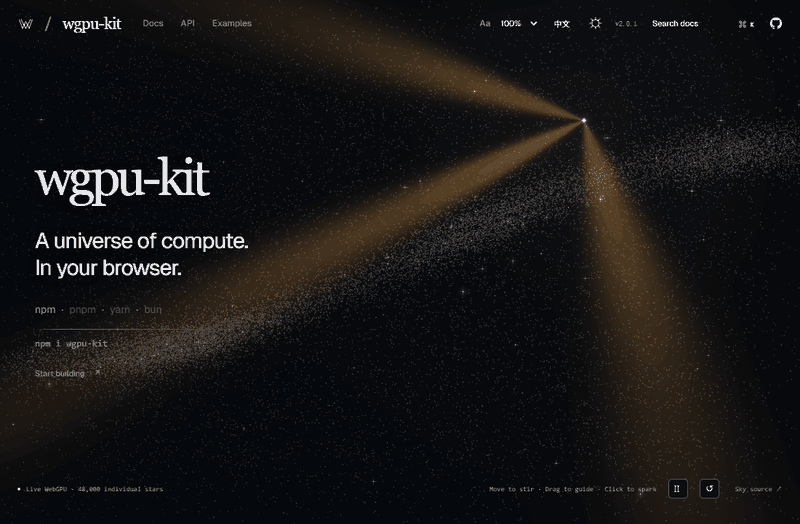

[**打开在线演示 →**](https://nanfengw0w.github.io/wgpu-kit/)

# wgpu-kit

[](https://www.npmjs.com/package/wgpu-kit) [](LICENSE)

**面向 TypeScript 的 WebGPU 计算工具：编写内核，让数据留在 GPU 上，自由组合计算步骤。**



[API 参考](docs/API.zh-CN.md) · [English](README.md)

wgpu-kit 负责缓冲分配、绑定声明、uniform 布局、管线准备和数据读回。你的计算逻辑仍使用 WGSL，需要支持 WebGPU 的浏览器。

## 核心能力

- **控制执行流程。** 先准备内核，再把多个步骤编码到自己的 command encoder，最后统一提交。单步计算也可以直接调用 `run()`。
- **GPU 常驻原语。** 前缀和、归约与空间网格提供 GPU 缓冲，后续内核可直接使用中间结果。
- **统一的数据声明。** Schema 提供类型化缓冲读写和 WGSL struct 生成；uniform 布局负责字段偏移与对齐。
- **可读的错误。** WGSL 编译错误映射到你的内核行号，缓冲类型、长度及参数错误带有明确说明。
- **保留原生接口。** 可直接访问 `Buffer.gpuBuffer`、`GpuContext.device`，通过 `rawKernel` 使用完整 WGSL，也可在创建上下文前接入已有设备。

## 从计算内核开始

```bash
npm install wgpu-kit
```

```ts
import { defineSchema, elementKernel } from 'wgpu-kit';

const Motion = defineSchema({ pos: 'vec2f', vel: 'vec2f' });
const data = await Motion.buffers(1024);
data.vel.write(Array.from({ length: 1024 }, () => ({ x: 1, y: 0 })));

const integrate = elementKernel({
  state: { pos: Motion.fields.pos },
  inputs: { vel: Motion.fields.vel },
  uniforms: { dt: 'f32' },
  code: `
    fn userFn(idx: u32, dt: f32) {
      pos[idx] = pos[idx] + vel[idx] * dt;
    }
  `,
});

await integrate.run(data.raws(), { dt: 0.02 });
```

Schema 为 JavaScript 数据提供类型约束，WGSL 函数体由 GPU 着色器编译器检查。

## 组合一次提交

接着增加一个内核，两个步骤共用同一组 GPU 缓冲。

```ts
import { GpuContext } from 'wgpu-kit';

const damp = elementKernel({
  state: { vel: 'vec2f' },
  uniforms: { friction: 'f32' },
  code: `
    fn userFn(idx: u32, friction: f32) {
      vel[idx] = vel[idx] * friction;
    }
  `,
});

await integrate.prepare();
await damp.prepare();
const { device } = await GpuContext.get();
const encoder = device.createCommandEncoder();

integrate.encode(encoder, data.raws(), { dt: 0.02 });
damp.encode(encoder, { vel: data.vel.raw }, { friction: 0.99 });
device.queue.submit([encoder.finish()]);
integrate.endSubmit();
damp.endSubmit();

console.log(await data.pos.read()); // CPU 需要结果时再读回。
integrate.destroy();
damp.destroy();
data.destroy();
```

每个 `elementKernel`、scan 或 reduce 实例在一次提交前编码一次，提交后调用各自的 `endSubmit()`。编码会向 encoder 添加计算 pass，请在没有打开 pass 时调用。`run()` 负责提交，读回数据或 `GpuContext.sync()` 才等待 GPU 完成。

## 在核心之上构建

| 导入 | 用途 |
| --- | --- |
| `wgpu-kit` | 内核、缓冲、schema、scan/reduce 与 pack 注册 |
| `wgpu-kit/grid` | GPU 常驻的格子范围与实体排序 |
| `wgpu-kit/particles` | 基于计算层的粒子模拟与渲染 |
| `wgpu-kit/react` | `ParticleCanvas` |
| `wgpu-kit/three` | 读回快照并写入 three.js points |
| `wgpu-kit/media` | 画布录制 |
| `wgpu-kit/observe` | 计时、设备回调和画布助手 |
| `wgpu-kit/vite` | WGSL 内核热重载 |

通过 `createScan().encode()` 和 `createReduce().sumInto()` 将中间结果留在 GPU 上。`createNeighborGrid()` 按格子组织位置数据，供自己的邻域内核使用。接口签名、布局与生命周期详见 [API 参考](docs/API.zh-CN.md)。

已有 WebGPU 应用可以在首次 `GpuContext.get()` 或 `Buffer.create()` 之前调用 `GpuContext.adopt(device)`，让自己的资源与 wgpu-kit 共用该设备。

## 许可证

[MIT](LICENSE)
