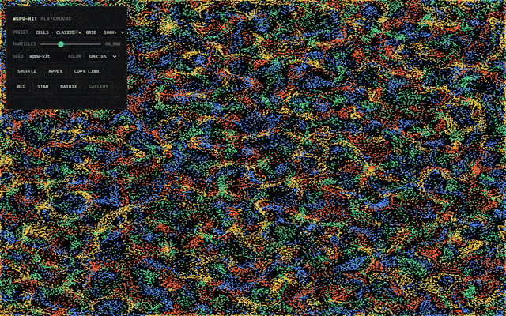
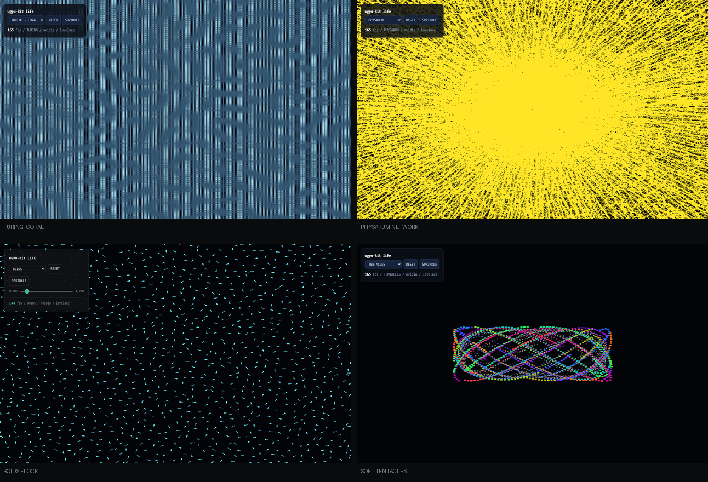

# wgpu-kit

> 浏览器创意编程 GPU 工具包:20 万粒子物理 120fps,只需 5 行代码。
> WebGPU 计算的全套样板——设备、缓冲、管线、dispatch、双缓冲、读回、错误行号映射——打包成两层简单 API。

English: [README.md](README.md) · [API 参考(中文)](docs/API.zh-CN.md) · [API Reference (English)](docs/API.md) · **[在线演示](https://nanfengw0w.github.io/wgpu-kit/)**



## 快速开始

```bash
npm i wgpu-kit
```

**5 行,10 万粒子:**

```ts
import { particles } from 'wgpu-kit';

const sim = await particles({ count: 100_000, forces: 'cells' });
await sim.attach(canvas);
function frame() { sim.tick(); requestAnimationFrame(frame); }
frame();
```

**自定义 GPU 计算**——你只写"单个元素怎么变"的函数:

```ts
import { elementKernel, Buffer } from 'wgpu-kit';

const pos = await Buffer.create('vec2f', 100_000);
const vel = await Buffer.create('vec2f', 100_000);

const integrate = elementKernel({
  state:   { pos: 'vec2f' },
  inputs:  { vel: 'vec2f' },
  uniforms: { dt: 'f32' },
  code: `
    fn userFn(idx: u32, dt: f32) {
      pos[idx] = (pos[idx] + vel[idx] * dt) * 0.99;
    }
  `,
});
await integrate.run({ pos, vel }, { dt: 0.02 });
```

## 入口一览

| 导入 | 用途 |
| --- | --- |
| `wgpu-kit` | elementKernel 核心 + Buffer / PingPong / rawKernel |
| `wgpu-kit/particles` | 粒子生命:力矩阵预设、自适应世界、热更新 |
| `wgpu-kit/life` | 图灵斑图 / 粘菌 / Boids / 软体触手 |
| `wgpu-kit/fields` | 向量场平迹 |
| `wgpu-kit/image` | GPU 滤镜管线(blur/sharpen/edge/…) |
| `wgpu-kit/react` | `<ParticleCanvas />` |
| `wgpu-kit/three` | three.js 快照互通 |
| `wgpu-kit/media` | 画布录制(webm/mp4) |
| `wgpu-kit/observe` | GPU 计时 / 设备诊断 / 画布助手 |
| `wgpu-kit/vite` | WGSL kernel 热重载 |



*life 包:图灵斑图 / 粘菌 / Boids / 软体触手 — [打开演示](https://nanfengw0w.github.io/wgpu-kit/life.html)。*

## 数字(全部可复现)

| 指标 | 数值 | 环境 |
| --- | --- | --- |
| 粒子端到端 | 200,000 @ 122fps / 66,000 @ 144fps | RTX 4060 Laptop,playground 实测 |
| 粒子计算(grid) | 16k→262k 平坦,3.0→3.3ms/帧 | headless 基准 |
| 邻域算法 | grid 近似 O(N),66k 时比暴力快 8.5× | 同会话 A/B |
| 库体积 | core gzip ~10kB(共享上下文构建) | gzip |

## 三条设计铁律

1. **第二层 5 分钟出活,第一层不封顶**——`rawKernel` 与原生 `GPUBuffer` 逃生舱常开;
2. **错误说人话**——WGSL 编译失败映射回你的代码行号;
3. **基准即文档**——所有数字可复现;gzip 体积预算由 `npm run build` 强制核对。

## 支持矩阵

| 浏览器 | 状态 |
| --- | --- |
| Chrome / Edge 113+(含无头) | ✅ 全部验证在此完成(RTX 4060,D3D 后端) |
| Safari 18+ / Firefox | 🔶 WebGPU 可用即应工作;未实测,issue 欢迎 |
| WebGL2 / 无 WebGPU | ❌ 不做降级(设计决策);`detect.html` 可诊断 |

## 许可

[MIT](LICENSE)
